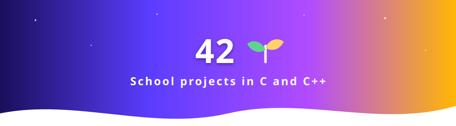

<!-- banner -->

<!-- /banner -->

# 🎓 42 — projects

My projects from the **42** school curriculum, in **C** and **C++**.
Each folder is the final version of a project (the original repositories are archived).

| Project | Language | What it is |
|---|---|---|
| [`libft`](libft/) · [`libft_full`](libft_full/) | C | My own C standard library (strings, memory, lists) |
| [`printf`](printf/) | C | A re-implementation of `printf` with variadic arguments |
| [`getnextline`](getnextline/) | C | Read a file line by line with a static buffer |
| [`push_swap`](push_swap/) | C | Sort a stack with two stacks and a minimal number of operations |
| [`pipex`](pipex/) | C | Shell pipes re-implemented: `fork`, `pipe`, `dup2`, `execve` |
| [`fdf`](fdf/) | C | Wireframe 3D maps rendered with the MiniLibX |
| [`philo`](philo/) | C | The dining philosophers: threads, mutexes, no data race |
| [`CPP`](CPP/) | C++ | The C++ modules: classes, inheritance, templates, STL |

More of my work: [🌱 The Seed](https://github.com/VZero911/The_Seed.V0-Public) — a Web3 + AI game.
